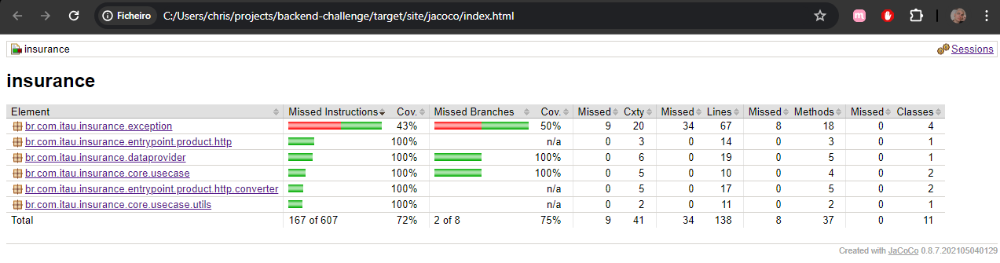
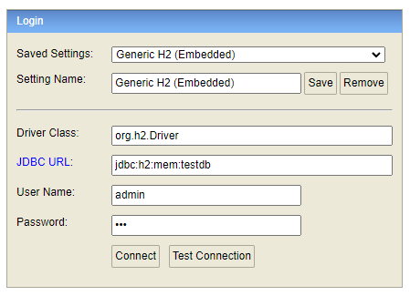
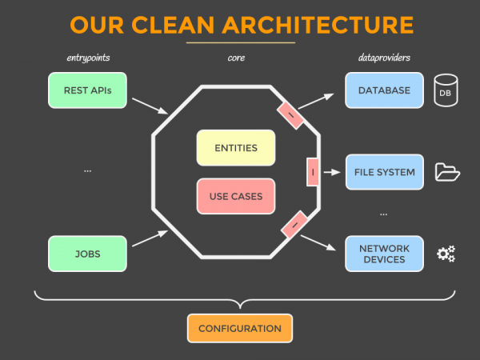

# Desafio Produtos de Seguros 🚀

API REST de Produtos de Seguros.

## Índice

* [Pré-requisitos](#prerequisitos)
* [Executando a aplicação localmente](#executaraplicacao)
* [Executando testes unitários](#executartestes)
* [Emitir relatório de cobertura de testes com Jacoco](#emitirrelatorio)
* [Testando endpoints](#executarswagger)
* [Acesso ao banco de dados H2](#executarh2)
* [Arquitetura do projeto](#arquitetura)

## <a name="prerequisitos">Pré-requisitos</a>

Para buildar e executar a aplicação você precisará:

- [JDK 17](https://www.oracle.com/java/technologies/downloads/?er=221886#java17)
- [Maven 3.9.7](https://maven.apache.org)

## <a name="executaraplicacao">Executando a aplicação localmente</a>

Existem várias maneiras de executar uma aplicação Spring Boot em sua máquina local. Uma maneira é executar o
método `main` na classe `src/main/java/br/com/itau/insurance/InsuranceApplication.java` da sua IDE.

De forma alternativa, você pode utilizar
o [Spring Boot Maven plugin](https://docs.spring.io/spring-boot/docs/current/reference/html/build-tool-plugins-maven-plugin.html)
e executar o comando via cmd (ou linha de comando de preferência) na raíz do projeto:

```shell
mvn spring-boot:run
```

## <a name="executartestes">Executando testes unitários</a>

Executar o comando via cmd (ou linha de comando de preferência) na raíz do projeto:

```shell
mvn test
```

## <a name="emitirrelatorio">Emitir relatório de cobertura de testes com Jacoco</a>

Executar o comando via cmd (ou linha de comando de preferência) na raíz do projeto:

```shell
mvn clean test jacoco:report
```

Após execução, acesse o arquivo abaixo para exibir o relatório:

```text
...\backend-challenge\target\site\jacoco\index.html
``` 



## <a name="executarswagger">Testando endpoints</a>

Após inicializar o projeto localmente, acesse o [Swagger](http://localhost:8080/swagger-ui/index.html). Lá haverá a
possibilidade de testes dos endpoints e informações sobre payloads de entrada e saída da aplicação.

## <a name="executarh2">Acesso ao banco de dados H2</a>

Acesse o [Console H2](http://localhost:8080/h2-console/) para verificar a persistência dos dados, para isso, preencha as
informações como no exemplo abaixo:

```text
Driver Class=org.h2.Driver
JDBC URL=jdbc:h2:mem:testdb
User Name=admin
Password=123
```

Ficando nesta disposição para efetuar a conexão:



## <a name="arquitetura">Arquitetura do projeto</a>

Para desenvolvimento do projeto, optei, com algumas adaptações, pelo visual hexagonal de arquitetura limpa, que traz
como pontos positivos facilidade de manutenção do código,
redução de complexidade, entre outros.

Referência: https://developers.redhat.com/articles/2023/04/17/my-advice-building-maintainable-clean-architecture#

Exemplo base de disposição de diretórios: https://github.com/mattia-battiston/clean-architecture-example


